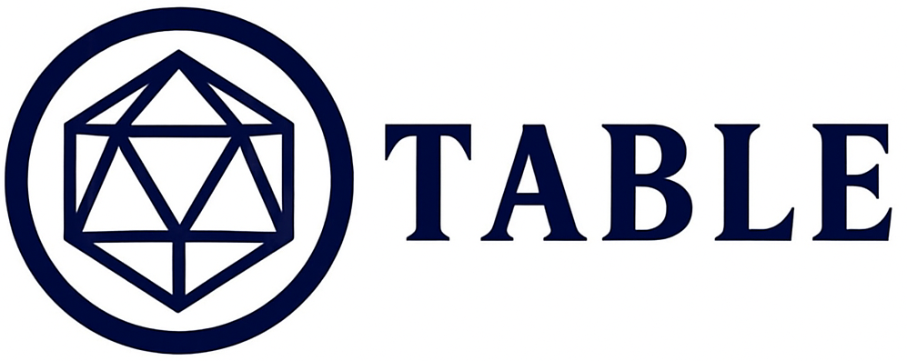

  
  
  <h3>Plataforma Digital para RPG de Mesa 🐉</h3>
  

    
    
    
    
    
    
  

---

A **TABLE** é um sistema web (atualmente em desenvolvimento) criado como **Trabalho de Conclusão de Curso (TCC)** pela equipa SYNERA, da **ETEC Dra. Ruth Cardoso (São Vicente)**. 

O objetivo do projeto é facilitar a vida de jogadores e mestres de RPG, reunindo numa única plataforma as ferramentas essenciais para criar, organizar e conduzir campanhas de forma totalmente digital, segura e imersiva.

## ✨ O que o projeto faz?

* **🧙‍♂️ Fichas Digitais Interativas:** Criação passo a passo de personagens com separadores para Descrição, Origens, Atributos e Classes. O sistema conta com distribuição inteligente de pontos e validação automática.
* **⚙️ Criação de Sistemas Customizados:** Um painel exclusivo para Mestres criarem as suas próprias regras, adicionando status, atributos e componentes como Perícias e Monstros.
* **📖 Guia de Jogo:** Uma área dedicada a ensinar iniciantes, separando as responsabilidades de como atuar como "Jogador" e como "Mestre".

## 🚀 Tecnologias Utilizadas

Este projeto utiliza uma *stack* completa (Front-end e Back-end) para garantir um design único, responsivo e um sistema de dados robusto:

* **HTML5 & CSS3:** Estrutura semântica e estilização avançada com *Dark Theme*, Flexbox, Grid e animações personalizadas.
* **Vanilla JavaScript:** Lógica de interações *front-end*, controlo de abas, cálculos matemáticos de atributos e alertas visuais.
* **PHP:** Lógica de *back-end*, processamento de dados e autenticação.
* **MySQL:** Banco de dados relacional para armazenamento seguro de utilizadores, fichas de personagens e sistemas criados.

## 💻 Como testar o projeto

Para correr o projeto com o banco de dados a funcionar, o processo é bastante simples:

1. Abra o seu **XAMPP** e inicie os módulos **Apache** e **MySQL**.
2. No seu `phpMyAdmin`, crie o banco de dados e importe o ficheiro (tabela `.sql`) do projeto.
3. Aceda ao projeto no navegador através do `localhost` (ex: `http://localhost/nome-da-pasta`).

---

  <h3>⚔️ Pronto para a aventura? 🛡️</h3>
  
Desenvolvido com muita dedicação para o <b>TCC da ETEC Dra. Ruth Cardoso</b> pela equipe <b>SYNERA</b>.

  

